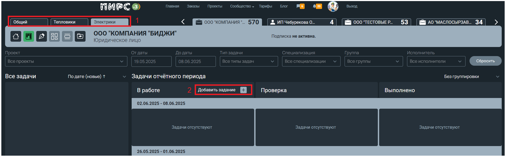

# Канбан-доска

Канбан - доска состоит из 4 колонок:

<figure><figcaption></figcaption></figure>

**Колонка "Все задачи" (backlog)**

В этой колонке отображаются все задачи, связанные с проектами, от исполнителей, ГИПов и заказчиков.
\
Здесь можно увидеть всю текущую работу по всем проектам.

**Колонка "В работе"**

Перед началом выполнения задачи перетащите её из колонки «Все задачи» или другой соответствующей стадии в колонку «В работе». В этой колонке находятся задачи, которые сейчас выполняются.

**Колонка "Проверка"**

Для завершения выполнения задачи переместите её в колонку «Проверка». В этой стадии задача проходит проверку или контроль качества.

При переносе карточки в столбец “Проверка” открывается всплывающее окно с завершением раздела или другой задачи.&#x20;
gitbook
<figure><figcaption></figcaption></figure>

На карточке в колонке "Проверка" отображается дополнительная иконка “Пустой круг”, которая указывает на необходимость согласования данной работы смежными исполнителями, ГИПом или заказчиком проекта (в случае, если на проекте нет ГИПа).
gitbook
<figure><figcaption></figcaption></figure>

Если на карточке нет иконки, значит данному пользователю нет необходимости согласовывать эту работу.&#x20;

При согласовании данной работы иконка меняет свой цвет на зеленый с отметкой в виде галочки.
gitbook
<figure><figcaption></figcaption></figure>

Карточки задач, которые не согласованы со смежниками, отображаются с дополнительным ярлыком слева с надписью “Отказано”.

В правом верхнем углу карточки появляется символ, при наведении на который отображается подсказка с рекомендациями по дальнейшим действиям.
gitbook
<figure><figcaption></figcaption></figure>

Подробную информацию по задаче можно посмотреть, кликнув по ней левой кнопкой мышки.

Для перехода к задаче достаточно нажать на ссылку "Перейти к задаче".  Раздел откроется в новом окне.
gitbook
<figure><figcaption></figcaption></figure>

**Колонка "Выполнено"**

После согласований и приемки карточка из колонки "Проверка" автоматически перемещается в колонку “Выполнено”.

## **Цветовая индикация на карточках**

На странице доски KANBAN реализована цветовая подсветка дат задач, которая помогает быстро определить статус выполнения:

1. Красный цвет — дата выполнения задачи просрочена.
   \
   Карточка показывает, что срок выполнения уже прошёл.
2. Жёлтый цвет — дата исполнения скоро истечёт.
   \
   Карточка сигнализирует о приближающемся сроке завершения задачи.

Даты на карточках задач автоматически подсвечиваются в соответствии с их статусом.
gitbook
Это позволяет оперативно реагировать на просроченные задачи и своевременно завершать те, сроки которых скоро истекают.

<figure><figcaption></figcaption></figure>

На доске отображаются задачи за текущую неделю и три предыдущие недели.
\
Для просмотра задач за другой период используйте доступные фильтры.
\

gitbook
## **Оперативная задача**

Оперативные задачи можно создавать на общей KANBAN доске и на доске команды.

<figure><figcaption></figcaption></figure>

Для создания оперативной задачи нажмите кнопку "Добавить задание" в колонке "В работе".
\
gitbook

<mark style="color:orange;">**Обратите внимание: создавать задачи на общей доске KANBAN можно только вниз по иерархии проекта. На доске отдела или команды любой её участник может добавить задачу другому члену команды.**</mark>

Откроется форма создания задачи.

<figure><figcaption></figcaption></figure>

После нажатия откроется форма для ввода данных.

Заполните поля:

“Проект” — выберите нужный проект из предложенного списка. Проекты отображаются иерархически. На доске команды, данное поле можно не заполнять.

“Текст задачи” — укажите описание того, что необходимо выполнить.

“Специализация” — выберите специализацию исполнителя из списка, которому ставится оперативная задача.

“Исполнитель” — выберите пользователя из списка, имеющего доступ к проекту (исполнители разделов и задач, ГИП, автор проекта).
gitbook
“Контрольный срок” — укажите дату, к которой задача должна быть выполнена.

Для выделения важной задачи активируйте переключатель "Важная задача".

При этом к карточке прикрепляется ярлык “Важно!”, что помогает выделить приоритетные задания.

<figure><figcaption></figcaption></figure>
gitbook
## Редактирование задачи

Кликнув на карточку оперативной задачи, откроется форма редактирования.&#x20;

Проект выбирается при создании задачи и изменить его при редактировании невозможно.&#x20;

<figure><figcaption></figcaption></figure>

После окончания редактирования важно не забыть сохранить изменения, нажав на кнопку **Сохранить**.
gitbook
## Удаление оперативной задачи

Удалить задание можно, кликнув на карточку оперативной задачи.&#x20;

В открывшейся форме нажать на кнопку **Удалить.**

<figure><figcaption></figcaption></figure>

## Сортировка, фильтры и группировка задач.

Функция сортировки расположена в столбце "Все задачи".

Все задачи можно отсоgitbookь, выбрав удобную вам сортировку:

1. По дате (новые) "По дате ↑"
2. По дате (старые) "По дате ↓"
3. По специализации иgitbookозрастание) "По специал. и дате ↑"
4. По специализации и дате (убывание) "По специал. и дате ↓"

<figure><figcaption></figcaption></figure>

С помощью фильтров можно настроить и сузить поиск задач, а возможность множественного выбора значений позволяет расширить получаемый список задач. Кнопка "Сбросить" стирает все введенные ранее значения.

<figure><figcaption></figcaption></figure>
gitbook
Группировка карточек:

1. Без группировки - отображаются все задачи без группировки
2. По специализации - карточки сгруппированы по специализации. Пример: Функции ГИП, Архитектурные решения, Конструктивные решения и т.д.
3. По типу - карточки сгруппированы по типу задач. Пример: Оперативные задачи, Исходящие задания, Входящие задания, Предварительные решения по разделу и т.д.

<figure><figcaption></figcaption></figure>

Изменить группировку можно путём выбора необходимого пункта в выпадающем списке.
