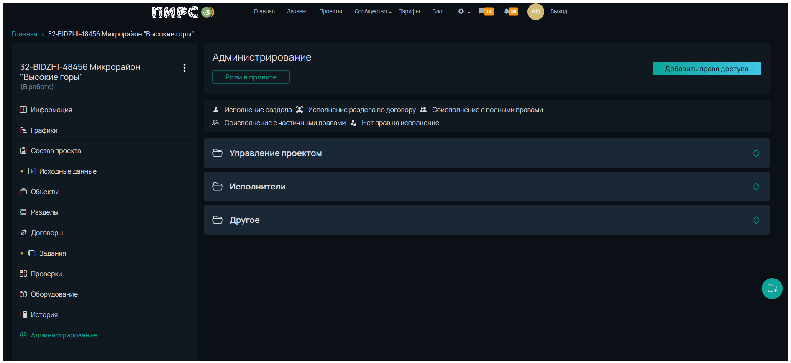

# Управление правами доступа

Управление правами доступа осуществляется со страницы проекта, «Администрирование».

Добавлен аккордеон с раскрывающимся списком пользователей, имеющих доступ к проекту, сгруппированных по их роли в проекте.

<figure><figcaption></figcaption></figure>

**Группа - управление проектом**

В аккордеоне «Управление проектом» – объединены сотрудники компании или специалисты, которые имеют расширенные права управления проектом:

Автор проекта - заказчик проекта

Главный инженер проекта организации или организации подрядчика

Помощники главного инженера - сотрудники организации автора проекта, либо сотрудник организации главного инженера проекта, либо привлеченный сторонний специалист.

<figure><figcaption></figcaption></figure>

**Кнопки управления**

Редактирование прав (карандашик, 2) — открывает окно выбора организации и исполнителя.\
Удаление прав (корзинка, 3) — удаляет права у ГИП и помощников.\
Делегирование прав (чек-бокс, 4) — даёт помощнику ГИП такие же права, как у ГИП.

<figure><figcaption></figcaption></figure>

**Группа - исполнители**

В этой группе исполнители разделов сгруппированы по специализациям, по организациям, с отображением прав доступа на разделы.

<figure><figcaption></figcaption></figure>

.png>)  -  Раздел, на котором пользователь является исполнителем обозначен зелёной плашкой с иконкой «человек» с полной зелёной заливкой.

.png>)  -  Раздел, на который исполнителю выданы полные права обозначен зеленой плашкой с иконкой «два человечка» с полной заливкой.

.png>)  -  Раздел, на который исполнителю выданы ограниченные права обозначен серой плашкой с иконкой «два человечка» без заливки.

.png>)  -  Раздел, на который у пользователя нет прав обозначен оконтуренной плашкой с иконкой «Человечек с замком» с полной заливкой.

.png>)  -  Раздел, который выполняется по договору обозначен зеленой плашкой с иконкой «Человечек внутри границ»

На плашках с возможностью управления правами есть иконка «залитый треугольник», вызывающая дополнительное меню управления.

<figure><figcaption></figcaption></figure>

.png>)

**Управление правами**

Для добавления новых пользователей без прав нужно нажать на кнопку «+ Список доступных исполнителей», выдать права по нужным разделам. После внесения изменений необходимо нажать кнопку «Добавить» для сохранения и пересчёта связей.

<figure><figcaption></figcaption></figure>

**Группа «Другое»**

Добавление пользователей происходит через кнопку «Добавить права доступа».

<figure><figcaption></figcaption></figure>

Всплывающее окно содержит поля: организация (автора проекта или ГИПа), пользователь (сотрудник выбранной организации), роль (наблюдатель, нормоконтролёр, BIM-координатор)

<figure><figcaption></figcaption></figure>

**Права различных ролей**

Автор проекта (руководитель)   &#x20;

&#x20;     Права - Полные права на управление ГИП, помощниками ГИП, исполнителями, группой «Другое»&#x20;

&#x20;     Ограничения - Ограничен в управлении нанятыми по договору

Руководитель (не руководитель организации)

&#x20;     Права - Полные права на управление ГИП, помощниками ГИП, исполнителями группой «Другое»&#x20;

&#x20;     Ограничения - Ограничен в управлении нанятыми по договору

Главный инженер проекта (ГИП)

&#x20;     Права - Полные права на управление помощником ГИП, исполнителями из организаций автора и ГИПа

&#x20;     Ограничения - Ограничен в управлении нанятыми по договору

Помощник ГИП

&#x20;     Права - Без делегирования — ограниченные права; при делегировании — равны правам ГИПа

&#x20;     Ограничения - Ограничен в управлении нанятыми по договору

Руководитель бюро/начальник отдела

&#x20;     Права - Управляет правами своих сотрудников: полные/ограниченные/отключение доступа

&#x20;     Ограничения - Может управлять только сотрудниками своей команды. Ограничен в управлении нанятыми по договору

Исполнитель

&#x20;     Права - Может выдавать полные или ограниченные права сотрудникам той же организации и специализации

&#x20;     Ограничения - Ограничен в управлении нанятыми по договору

**Типы прав доступа**

Полные права  - Любые действия: загрузка документов, завершение работ за исполнителя; доступ к PIRS.STORAGE с возможностью изменять/удалять/перемещать файлы. Ответственность за действия несёт выдавший права исполнитель.

Ограниченные права - Загрузка документации; доступ к PIRS.STORAGE для добавления файлов; нельзя удалять или перемещать файлы; нельзя завершать работы по разделу.
